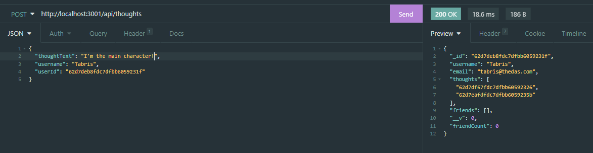

# Social-network-API-MongoDB


## Description

This project required the creation of a social network API using Express.js, a MongoDB database, and the Mongoose ODM. The functionality included getting all users and thoughts, getting one user or thought, posting new users and thoughts, updating user and thought information, and deleting users and thoughts. It also required the creation and deletion of friends to attach to users, and reactions to attach to thoughts.

No seed data was provided, so it was also required to create my own data using Insomnia after I created the API.

> The walkthrough video of this application can be viewed at https://drive.google.com/file/d/1e9_a8ADhC86j7a5DG-0cDlPwgCWoqKjZ/view?usp=sharing

## Table of contents

- [User story](#user-story)
- [Acceptance criteria](#acceptance-criteria)
- [Technologies used/built with](#technologies-usedbuilt-with)
- [Installation](#installation)
- [Usage](#usage)
- [Credits](#credits)
- [License](#license)

## User story

```
AS A social media startup
I WANT an API for my social network that uses a NoSQL database
SO THAT my website can handle large amounts of unstructured data
```

## Acceptance criteria

```
GIVEN a social network API
WHEN I enter the command to invoke the application
THEN my server is started and the Mongoose models are synced to the MongoDB database
WHEN I open API GET routes in Insomnia for users and thoughts
THEN the data for each of these routes is displayed in a formatted JSON
WHEN I test API POST, PUT, and DELETE routes in Insomnia
THEN I am able to successfully create, update, and delete users and thoughts in my database
WHEN I test API POST and DELETE routes in Insomnia
THEN I am able to successfully create and delete reactions to thoughts and add and remove friends to a user’s friend list
```

## Technologies used/built with

This project used the following technologies to build it:

- JavaScript
- MongoDB
- [Express.js](https://expressjs.com/)
- [Moment.js](https://momentjs.com/)
- [Mongoose](https://mongoosejs.com/)

## Installation

1. Clone the repo (HTTPS: `git clone https://github.com/CharDige/Social-network-API-MongoDB.git` or SSH: `git clone git@github.com:CharDige/Social-network-API-MongoDB.git`)

2. Install all NPM packages by running `npm i` in the command-line. Or, if you wish to install each NPM package individually:

- Install Express.js NPM package `npm install express`
- Install Moment.js NPM package `npm install moment`
- Install Mongoose NPM package `npm install mongoose`


## Usage

Below, you will find a link to a walkthrough video that shows the application in action. You will also find screenshots of its use.

### Walkthrough video

If you wish to see this social network API in action, you can watch the walkthrough video: https://drive.google.com/file/d/1e9_a8ADhC86j7a5DG-0cDlPwgCWoqKjZ/view?usp=sharing

### Screenshots

This social network API is set up to interact with GET, POST, PUT and DELETE requests. Below, you will find some screenshots of these requests being done in Insomnia. Watch the walkthrough video in the above section for a full demonstration.

**GET all users**


**GET one user**


**POST new thought**



**PUT thought**


**DELETE user**


**POST new friend**


**DELETE reaction**


## Credits

Here's a list of resources I'd like to credit that really helped with the development of this application:

- [Mastering JS - Understanding 'unique' in Mongoose](https://masteringjs.io/tutorials/mongoose/unique)
- [Mongoose - API docs](https://mongoosejs.com/docs/api.html)
- [Mongoose - SchemaTypes](https://mongoosejs.com/docs/schematypes.html)
- [Mongoose - Validation](https://mongoosejs.com/docs/validation.html)
- [Moment.js - Documentation](https://momentjs.com/docs/)
- [tmurphree - mongoose-cheatsheet.md](https://gist.github.com/tmurphree/1a6a8f575b7309c478fac406f0e893b2)

## License

[MIT License - Copyright (C) 2022 Charlotte Dige](./LICENSE)